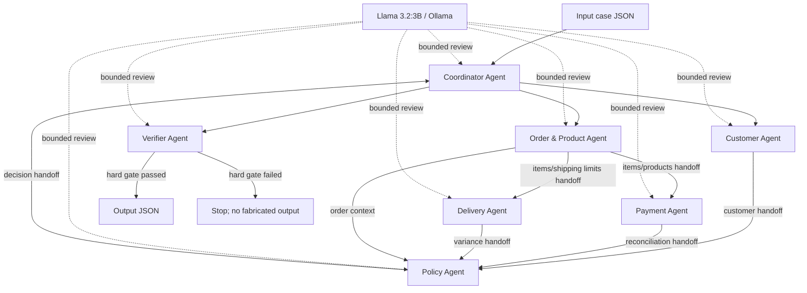

# Kiến trúc Multi-Agent — Olist Dispute Resolution

## 1. Mục tiêu và nguyên tắc

Hệ thống điều tra từng case bằng nhiều agent chuyên trách, giao tiếp qua handoff dictionary có cấu trúc. CSV là nguồn sự thật cho ID, timestamp và số tiền. Llama 3.2:3B chỉ review ngữ nghĩa của từng handoff và không có quyền thay đổi dữ liệu đã tính toán. Thiết kế này vừa thể hiện A2A thật, vừa tránh hallucination ở các trường bị chấm chính xác.



## 2. Agent, quyền truy cập và contract

| Agent | Quyền đọc | Input handoff | Output handoff | Không được làm |
| --- | --- | --- | --- | --- |
| Coordinator | Case JSON, kết quả agent | Case hợp lệ | Output đang lắp ráp | Không tự kết luận policy hoặc sửa evidence |
| Customer | `orders`, `customers` | Target order | `customer_unique_id`, lịch sử order | Không đưa order lịch sử vào affected entities |
| Order & Product | `orders`, `order_items`, `products`, `sellers` | Target order | Item, seller, product, category theo thứ tự nguồn | Không suy diễn item/seller bị thiếu |
| Payment | `order_payments` và handoff item | Order ID, item rows | Tổng tiền và reconciliation | Không coi installment là payment value mới |
| Delivery | Handoff order/item | Timestamp order, shipping limits | Delivery/handoff variance | Không tạo checkpoint vận chuyển không có trong CSV |
| Policy | Chỉ handoff của các agent | Customer/order/payment/delivery findings | Issue, root cause, responsibility, refund, actions | Không truy cập CSV hay tạo taxonomy ngoài V2 |
| Verifier | CSV read-only và output nháp | Output đầy đủ | Pass hoặc hard-gate error | Không tự sửa output lỗi |

Tất cả agent dùng cùng model `llama3.2:3b`. Mỗi lần review nhận payload rút gọn, `temperature=0`, giới hạn 80 output tokens và trả JSON. Kết quả review được ghi trace nhưng các phép tính deterministic vẫn là authoritative.

## 3. Luồng thực thi và handoff

1. Coordinator kiểm tra `case_id`, `claimed_order_id`, `policy_version` và sự tồn tại của order.
2. Customer Agent và Order & Product Agent chạy song song vì chỉ phụ thuộc target order.
3. Payment Agent và Delivery Agent chạy song song sau khi nhận item handoff.
4. Policy Agent nhận bốn kết quả chuyên môn và áp `EC_POLICY_V2` đúng thứ tự ưu tiên.
5. Coordinator lắp output, chỉ lấy target order vào `affected_entities` và áp mọi array limit.
6. Verifier đối chiếu ID với CSV, kiểm tra null handling, schema, evidence, refund/status và giới hạn.
7. Chỉ output vượt hard gate mới được ghi atomically; trace ghi mọi model review và A2A handoff.

Các handoff là dictionary riêng biệt thay vì một prompt tổng hợp. `ThreadPoolExecutor` thể hiện hai nhánh công việc độc lập, còn dependency giữa các giai đoạn được Coordinator giữ rõ ràng.

## 4. Áp dụng policy

Policy Agent xét primary issue theo thứ tự:

1. `canceled_order_paid`;
2. `unavailable_order_paid`;
3. `late_delivery_seller`;
4. `late_delivery_logistics`;
5. `valid_split_payment`;
6. `unsupported_late_claim`.

Secondary issue và resolution action được thêm đúng thứ tự trong README. Tiền dùng `Decimal` với `ROUND_HALF_UP`; chênh lệch thời gian tính từ timestamp gốc rồi làm tròn hai chữ số. Điều kiện trễ được so sánh trên timestamp gốc, không dựa trên số giờ đã làm tròn.

Với order không có item, `expected_total_brl`, `difference_brl` và `reconciled` là `null`; các mảng item/seller/product/category/handoff rỗng. Nếu dữ liệu không thỏa bất kỳ primary issue được định nghĩa, agent báo lỗi contract thay vì hallucinate.

## 5. Evidence và hard gate

Evidence được tạo theo thứ tự ổn định: order, item, payment, seller chịu trách nhiệm, policy. Verifier chỉ chấp nhận năm định dạng trong đề và kiểm tra từng ID tồn tại trong CSV tương ứng. Ngoài ra verifier kiểm tra:

- target order là affected order duy nhất;
- mọi array không vượt giới hạn;
- `confidence` thuộc `[0, 1]`;
- `case_status` nhất quán với refund;
- null handling cho order không có item;
- JSON không chứa NaN hoặc kiểu không serialize được.

## 6. Trace, metadata và khả năng tái lập

- `logging/trace.jsonl` bị truncate đầu mỗi lượt chạy; mỗi dòng có UTC timestamp, case, agent, event, recipient và tóm tắt handoff/model status.
- `logging/metadata.json` ghi model, parameter size, Ollama mode, số model call thành công/thất bại, runtime và số case hoàn tất.
- Lượt chạy nộp bài dùng `--llm-mode required`; nếu Ollama hoặc model không sẵn sàng, hệ thống dừng để không tuyên bố sai rằng đã dùng model.
- Output được ghi qua file tạm rồi replace nhằm tránh file JSON dở dang.

## 7. Cấu trúc source

```text
olist_agents/
  agents.py          # sáu specialist agents và EC_POLICY_V2
  orchestrator.py    # Coordinator, dependency graph, handoff, assembly
  repository.py      # CSV indexes read-only
  verifier.py        # hard gate
  llm.py             # Ollama/Llama 3.2 runtime
  trace.py           # JSONL audit trail
  cli.py             # batch runner, metadata, output zip
tests/                # policy, rounding và end-to-end test
run.py                # entry point
```
